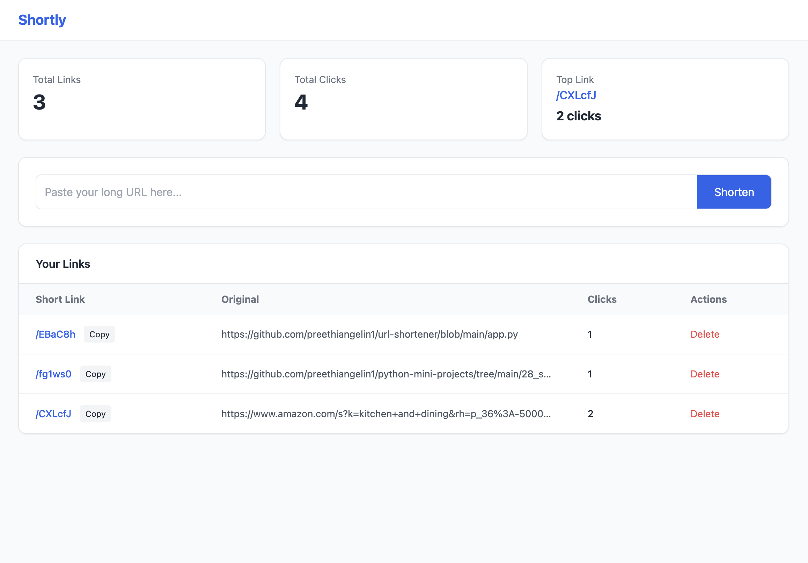

# 🔗 Shortly - URL Shortener

A modern URL shortener web app built using **Flask**, **SQLite3**, and a
clean **Tailwind CSS dashboard UI**.\
Create short links, track visits, and manage them with a simple
interface.

------------------------------------------------------------------------

## 🚀 Features

-   🔗 Shorten long URLs instantly
-   📊 Track number of visits (click analytics)
-   📋 Copy short & original URLs with one click
-   🗑️ Delete links
-   🎨 Modern SaaS-style UI (inspired by Bitly)
-   ⚡ Fast and lightweight (SQLite database)

------------------------------------------------------------------------

## 🛠️ Tech Stack

-   **Backend:** Flask (Python)
-   **Database:** SQLite3
-   **Frontend:** HTML + Tailwind CSS
-   **JavaScript:** Clipboard API (for copy functionality)

------------------------------------------------------------------------

## 📂 Project Structure

    url-shortener/
    │
    ├── app.py
    ├── database.db
    ├── templates/
    │   └── index.html
    |   └── 404.html
    │
    └── README.md

------------------------------------------------------------------------

## ⚙️ Setup & Installation

### 1. Clone the repository

``` bash
git clone https://github.com/preethiangelin1/url-shortener.git
cd url-shortener
```

### 2. Create virtual environment

``` bash
python3 -m venv .venv
source .venv/bin/activate   # Mac/Linux
.venv\Scripts\activate      # Windows
```

### 3. Install dependencies

``` bash
pip install flask
```

### 4. Run the application

``` bash
python app.py
```

### 5. Open in browser

    http://localhost:5050

------------------------------------------------------------------------

## 🧠 How It Works

1.  User submits a long URL
2.  A unique short code is generated
3.  Data is stored in SQLite:
    -   original URL
    -   short code
    -   visit count
4.  When short URL is accessed:
    -   Redirects to original URL
    -   Visit count is incremented

------------------------------------------------------------------------

## 📸 Screenshots


### Application




------------------------------------------------------------------------

## 🔮 Future Improvements

-   🔐 User authentication (multi-user system)
-   🔍 Search & filter links
-   📅 Created date tracking
-   📈 Click analytics graphs (Chart.js)
-   🌙 Dark mode


